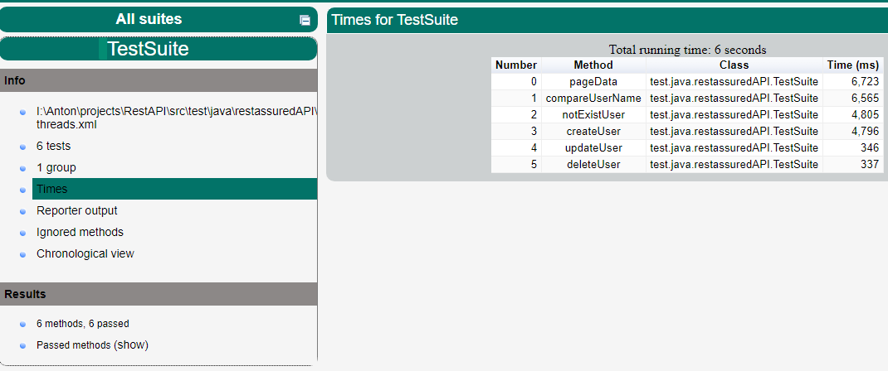

to run tests
>mvn clean test

generate allure report
> mvn allure:report

Задание для автоматизатора тестирования:

•	стек: Java8+, любой тестовый фреймворк, отчетность allure;

•	тесты должны запускаться параллельно;

•	разработать автотесты для проверки API https://reqres.in/

•	результат ожидаем в виде архива с инструкцией в виде txt-файла, как запускать;

•	подробные сценарии ниже.

1. Выполнить запрос GET https://reqres.in/api/users?page=1
   Проверить количество вернувшихся пользователей, номер страницы, общее количество пользователей, зафиксировать id одного из пользователей
2. Выполнить запрос GET https://reqres.in/api/users/{id пользователя}
   Сверить данные, полученные из этого запроса с запросом из пункта 1
3. Выполнить запрос GET https://reqres.in/api/users/23
   Проверить что возвращается 404 и в ответе пустой объект
4. Выполнить запрос POST https://reqres.in/api/users с телом запроса вида
   {
   "name": "morpheus",
   "job": "leader"
   }
   проверить параметр createdAt на дату создания пользователя
5. Выполнить запрос PATCH https://reqres.in/api/users/2 с телом запроса вида
   {
   "name": "morpheus",
   "job": "zion resident"
   }
   проверить параметр updatedAt на дату создания пользователя
6. Выполнить запрос DELETE https://reqres.in/api/users/2
   Проверить код ответа и отсутствие контента в теле ответа
